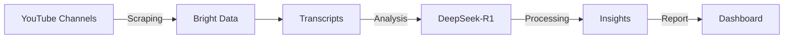
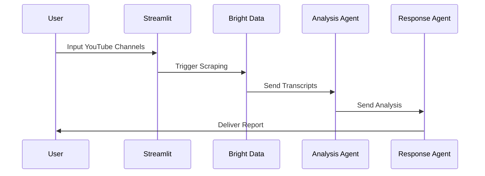

# 🤖 Multi-agent YouTube Analyst using DeepSeek-R1 and Bright Data

<div align="center">


[](https://github.com/your-username/youtube-analyst)
[](https://opensource.org/licenses/MIT)

</div>

## 🎯 Overview
A sophisticated multi-agent system that automatically analyzes YouTube content using cutting-edge AI technology! 



## ✨ Key Features
- 🎨 Streamlit-based chat interface for channel input
- 🕷️ Automated video and transcript scraping via Bright Data
- 🧠 Multi-agent analysis system:
  - 📊 Transcript analysis (trends, themes, sentiment)
  - 📝 Content synthesis and report generation
- 🎭 CrewAI-powered task orchestration
- 📈 Comprehensive trend analysis reporting

## 🛠️ Tech Stack
```ascii-art
+----------------+     +----------------+     +----------------+
|    CrewAI     |     |  Bright Data  |     |   Streamlit   |
|  Orchestration|     |   Scraping    |     |      UI       |
+----------------+     +----------------+     +----------------+
         |                    |                     |
         v                    v                     v
+------------------------------------------------+
|              DeepSeek-R1 Analysis              |
+------------------------------------------------+
```

## 🚀 Installation

1. Clone the repository:
```bash
# 🔍 Clone the project
git clone [repository-url]
cd youtube-analyst
```

2. Install dependencies:
```bash
# 📦 Install required packages
pip install -r requirements.txt
```

3. Set up environment variables:
```bash
# 🔐 Configure your environment
cp .env.example .env
# Add your Bright Data API key to .env
```

## 💻 Implementation Guide

### 1. 🌐 Bright Data Setup

```python
# 🔄 Dynamic Scraping Configuration
def trigger_scraping_channels(api_key, channels, start_dt, end_dt, country):
    dataset_id = "..."
    endpoint = f"https://api.brightdata.com/datasets/v3/trigger?dataset_id={dataset_id}&discover_by=url"
    
    # 📋 Prepare payload
    payload = [{"url": url, 
                "start_date": start_dt, 
                "end_date": end_dt, 
                "country": country} for url in channels]

    # 🚀 Execute request
    command = [
        "curl", "-H", f"Authorization: Bearer {api_key}",
        "-H", "Content-Type: application/json",
        "-d", json.dumps(payload), endpoint
    ]

    result = subprocess.run(command)
    return json.loads(result.stdout.strip())
```

### 2. 🤖 Multi-agent System Configuration

#### 📊 Transcript Analysis Agent:
```python
# 🧠 Intelligent Analysis Configuration
analysis_agent = Agent(
    role="YouTube Transcript Analyzer",
    goal="Analyze video transcripts and extract structured insights",
    backstory="Expert in content analysis, trend identification, and sentiment analysis",
    tools=[docs_tool]
)

# 📝 Task Definition
analysis_task = Task(
    description="Analyze transcripts and generate sectioned report",
    expected_output="Multi-section analysis with themes, trends, and sentiment",
    agent=analysis_agent
)
```

#### 🔄 Content Synthesis Agent:
```python
# 📊 Response Processing Setup
response_synthesizer_agent = Agent(
    role="Response Synthesizer Agent",
    goal="Create concise, actionable summaries from detailed analyses",
    backstory="Skilled in data synthesis and clear communication",
    verbose=True
)

# 📋 Task Configuration
response_task = Task(
    description="Synthesize analysis into actionable summary",
    expected_output="Concise overview with key findings and recommendations",
    agent=response_synthesizer_agent
)
```

### 3. 🎮 System Orchestration

```python
# 🔄 Orchestration Setup
crew = Crew(
    agents=[analysis_agent, response_synthesizer_agent],
    tasks=[analysis_task, response_task],
    process=Process.sequential,
    verbose=True
)

# 🚀 Launch Analysis
response = crew.kickoff(inputs={"file_paths": all_files})
```

## 🔄 Workflow Animation



## 🚀 Future Enhancements

- 🧠 AI model fine-tuning for improved accuracy
- 📊 Real-time analytics dashboard
- 🎯 Enhanced NLP for sentiment analysis
- 🌍 Multi-language support
- 📝 Custom reporting templates

## 🤝 Contributing

1. 🍴 Fork the repository
2. 🌿 Create a feature branch
3. ✍️ Commit your changes
4. 🚀 Push to the branch
5. 🎯 Open a Pull Request

## 📄 License

This project is licensed under the MIT License - see the LICENSE file for details.

## 👏 Acknowledgments

- 🧠 DeepSeek-R1 team for the powerful language model
- 🕷️ Bright Data for reliable web scraping capabilities
- 🤖 CrewAI community for multi-agent orchestration support

---

<div align="center">

### 🌟 Star this repository if you find it helpful!


Made with ❤️ by [Your Name]

</div>


